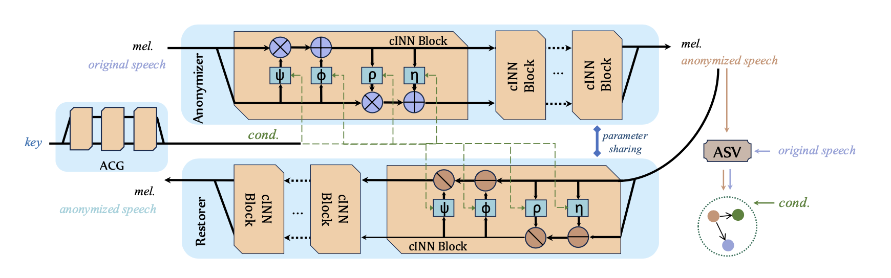

# Rano

## Architecture

The Architecture of Rano

&nbsp;
 

## Audio Samples

<table>
    <CAPTION>Speaker Anonymization via Rano</CAPTION>
    Original utterances in I~III are from the same speaker while IV-VI are from another speaker. Two keys are assigned to all the utterances from these two speakers, respectively.
<tr>
<td>  </td>
<td> Original Speech </td>
<td> Anonymized Speech </td>
<td> Restored Speech </td>
</tr>

<tr>
<td rowspan="2"> I </td>
<td colspan="3"> "Please call Stellar." </td>
</tr>
<tr>
<td> <audio controls id="player" onplay="pauseOthers(this);"><source src="assets/audio/orig225001.mp3" type="audio/mpeg"></audio> </td>
<td> <audio controls id="player" onplay="pauseOthers(this);"><source src="assets/audio/ano225001.mp3" type="audio/mpeg"></audio> </td>
<td> <audio controls id="player" onplay="pauseOthers(this);"><source src="assets/audio/res225001.mp3" type="audio/mpeg"></audio> </td>
</tr>

<tr>
<td rowspan="2"> II </td>
<td colspan="3"> "Ask her to bring these things with her from the store." </td>
</tr>
<tr>
<td> <audio controls id="player" onplay="pauseOthers(this);"><source src="assets/audio/orig225002.mp3" type="audio/mpeg"></audio> </td>
<td> <audio controls id="player" onplay="pauseOthers(this);"><source src="assets/audio/ano225002.mp3" type="audio/mpeg"></audio> </td>
<td> <audio controls id="player" onplay="pauseOthers(this);"><source src="assets/audio/res225002.mp3" type="audio/mpeg"></audio> </td>
</tr>

<tr>
<td rowspan="2"> III </td>
<td colspan="3"> "We also need a small plastic snake and a big toy frog for the kids." </td>
</tr>
<tr>
<td> <audio controls id="player" onplay="pauseOthers(this);"><source src="assets/audio/orig225004.mp3" type="audio/mpeg"></audio> </td>
<td> <audio controls id="player" onplay="pauseOthers(this);"><source src="assets/audio/ano225004.mp3" type="audio/mpeg"></audio> </td>
<td> <audio controls id="player" onplay="pauseOthers(this);"><source src="assets/audio/res225004.mp3" type="audio/mpeg"></audio> </td>
</tr>	

<tr>
<td rowspan="2"> IV </td>
<td colspan="3"> "They said she was stable." </td>
</tr>
<tr>
<td> <audio controls id="player" onplay="pauseOthers(this);"><source src="assets/audio/orig246046.mp3" type="audio/mpeg"></audio> </td>
<td> <audio controls id="player" onplay="pauseOthers(this);"><source src="assets/audio/ano246046.mp3" type="audio/mpeg"></audio> </td>
<td> <audio controls id="player" onplay="pauseOthers(this);"><source src="assets/audio/res246046.mp3" type="audio/mpeg"></audio> </td>
</tr>

<tr>
<td rowspan="2"> V </td>
<td colspan="3"> "Is a drug dealer?" </td>
</tr>
<tr>
<td> <audio controls id="player" onplay="pauseOthers(this);"><source src="assets/audio/orig246047.mp3" type="audio/mpeg"></audio> </td>
<td> <audio controls id="player" onplay="pauseOthers(this);"><source src="assets/audio/ano246047.mp3" type="audio/mpeg"></audio> </td>
<td> <audio controls id="player" onplay="pauseOthers(this);"><source src="assets/audio/res246047.mp3" type="audio/mpeg"></audio> </td>
</tr>

<tr>
<td rowspan="2"> VI </td>
<td colspan="3"> "The State would provide." </td>
</tr>
<tr>
<td> <audio controls id="player" onplay="pauseOthers(this);"><source src="assets/audio/orig246049.mp3" type="audio/mpeg"></audio> </td>
<td> <audio controls id="player" onplay="pauseOthers(this);"><source src="assets/audio/ano246049.mp3" type="audio/mpeg"></audio> </td>
<td> <audio controls id="player" onplay="pauseOthers(this);"><source src="assets/audio/res246049.mp3" type="audio/mpeg"></audio> </td>
</tr>
</table>

&nbsp;
 

## Mel-Spectrogram of the Above Tasks

Task I

Task II

Task III

Task IV

Task V

Task VI

&nbsp;
 

&nbsp;
 

